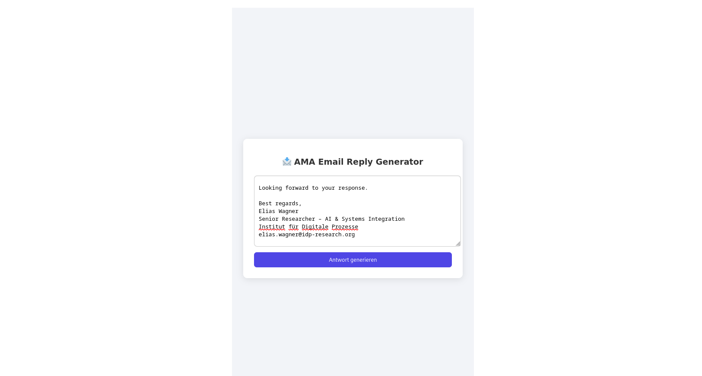

# 🤖 AMA Email-Chatbot

A private chatbot that generates professional replies to emails based on your personal writing style.  
Built with FastAPI, React, and LangChain using local embeddings from your sent emails.

---

## ✅ Completed Features

| Phase                    | Task                                                      | Tools / Notes                                              |
|--------------------------|-----------------------------------------------------------|------------------------------------------------------------|
| **1. Data Collection**   | Fetch sent emails from Gmail                              | Gmail API, `credentials.json` via OAuth2                  |
| **2. Backend (FastAPI)** | FastAPI backend for generating email replies              | `fastapi`, `uvicorn`, `dotenv`, `langchain`, `openai`     |
|                          | In-memory vector DB from previous emails                  | `SentenceTransformer` + `langchain_core.vectorstores`     |
|                          | RAG chain for tone injection                              | `RetrievalQA`, custom prompt                              |
|                          | CORS enabled                                              | `fastapi.middleware.cors`                                 |
| **3. Frontend (React)**  | React frontend with textarea + response output            | `vite`, `react`, `fetch`                                  |
|                          | Displays editable response with clean UI                  | Centered layout, styled with shadows                      |

---

## 🧠 How It Works

- The app loads your past sent emails from a text file.
- These emails are embedded using `sentence-transformers` and stored in memory.
- When you paste a new email, the backend retrieves similar examples to shape the tone.
- The reply is generated using a prompt-injected LLM (OpenAI or Gemini).
- The frontend displays the response, editable before sending.

---

## 🔧 Setup

### 1. Install Python packages

```bash
pip install fastapi uvicorn openai langchain sentence-transformers python-dotenv
```

### 2. Create `.env` file

```ini
GOOGLE_API_KEY=your-google-api-key
```

### 3. Run the FastAPI backend

```bash
uvicorn app.main:app --reload
```

API will be available at:  
`http://127.0.0.1:8000/generate-reply`

---

## 🖥️ Frontend Setup



### 1. Install Node dependencies

```bash
npm install
```

### 2. Run the React development server

```bash
npm run dev
```

Frontend will be running at:  
`http://localhost:5173`

---

## 📥 Gmail Email Fetching

1. Set up a project in [Google Cloud Console](https://console.cloud.google.com/)
2. Enable the Gmail API and download `credentials.json` (see below)
3. Run:

```bash
python email_fetcher/main.py
```

This saves your cleaned sent emails to `sent_emails_cleaned.txt`

---
## Downloading `credentials.json` for Gmail API

Follow these steps to download the `credentials.json` file for the Google API:

### 1. Go to the Google Cloud Console
   - Navigate to [Google Cloud Console](https://console.cloud.google.com/).

### 2. Create a Project
   - Select or create a project by clicking on the **Select a Project** dropdown in the top navigation bar. Then, click **New Project** to create one. Name it (e.g., `AMA-Chatbot`).

### 3. Enable Gmail API
   - Go to **APIs & Services > Library**.
   - Search for **Gmail API** and click on it.
   - Click the **Enable** button to activate the Gmail API for your project.

### 4. Create OAuth 2.0 Credentials
   - Navigate to **APIs & Services > Credentials**.
   - Click **Create Credentials** and select **OAuth 2.0 Client IDs**.
   - Choose **Application Type** as **Desktop App**.
   - Name the credentials (e.g., `AMA Chatbot`).
   - Click **Create**.

### 5. Download the `credentials.json`
   - After the credentials are created, click the **Download** icon next to your **OAuth 2.0 Client ID**.
   - Save the `credentials.json` file to your local machine and place it in the directory where your script is located.

This file is used to authenticate your application when accessing Gmail data via the API.

## ✉️ Example Email Input

```text
Sehr geehrter Herr Kleber,  
vielen Dank für die interessante Präsentation.  
Wir würden gerne in Kontakt bleiben und möchten wissen,  
ob eine mögliche Zusammenarbeit im Bereich Modellierung denkbar ist.  

Mit freundlichen Grüßen  
Dr. Sophie Müller
```

---

## 📌 Notes

- All replies will end with your full name: **Julian M. Kleber**
- You can easily switch between OpenAI and Gemini in the backend
- Responses are always editable in the frontend before sending

---


## ✅ Status: Working Prototype

- Works locally (frontend + backend)
- Generates smart, human replies
- Preserves tone from sent emails

---